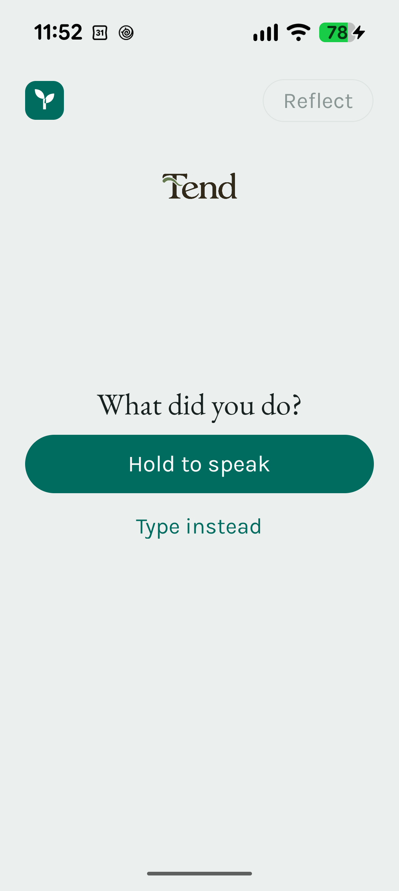
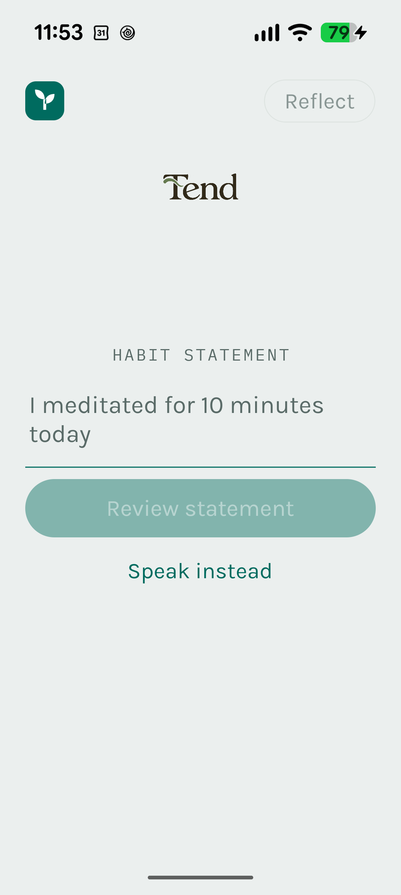
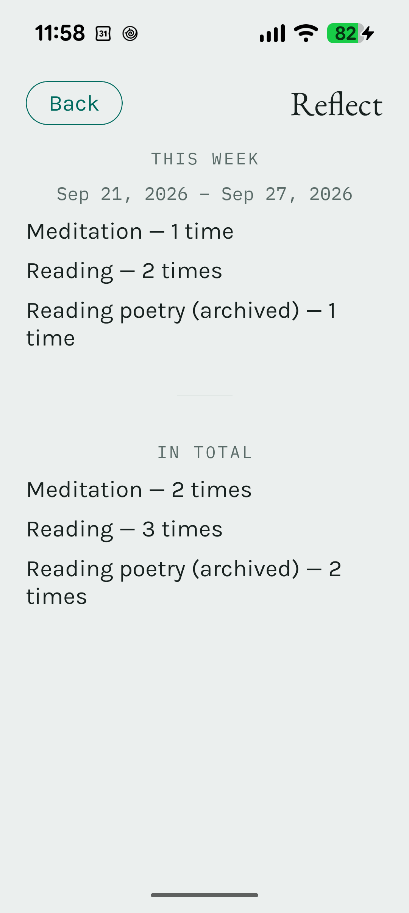

# Tend

Tend is a calm, local-first Android habit tracker for people who want to record
what happened without turning reflection into another task. Speak or type a
plain-language Habit Statement, review Tend's interpretation, and explicitly
confirm before anything is saved.

The result is an Android experience built around deliberate capture: it keeps
the initial screen quiet, asks for confirmation before meaningful changes,
and makes recent activity available by scrolling rather than demanding
attention.

## Snapshots

<p align="center">
  
  
  
</p>

- **Track:** one focused prompt; recent activity begins below the initial
  viewport.
- **Capture:** plain-language input is reviewed before Tend creates a Habit or
  saves an entry.
- **Reflect:** weekly and all-time activity counts are separated by Habit, one
  line at a time.

These are clean Pixel device captures. The sample statement is illustrative and
was not saved while creating the screenshots.

## Product decisions

- **Confirmation before change.** Statements never silently create Habits or
  save entries. The interpretation is visible and editable before persistence.
- **Local-first interpretation.** V1 uses a deterministic interpreter for
  supported Habit Statements. Ambiguous local matches ask the person to choose
  a Habit locally rather than deferring to a hosted service.
- **Calm information hierarchy.** The Track screen prioritizes one capture
  action; the last five activities are available after scrolling. Reflection is
  a separate, readable view.
- **Recoverable management.** Archive preserves history; restore is explicit.
  Destructive entry deletion uses a blocking confirmation dialog.
- **Accessible interaction.** Keyboard alternatives, accessibility labels,
  live feedback, reduced-motion awareness, and a light-only visual treatment
  are part of the app rather than afterthoughts.

## Technical approach

- Expo / React Native with TypeScript
- Android-first physical-device acceptance
- Local persistence through AsyncStorage
- Deterministic parsing and domain validation in `src/domain/`
- Optional hosted interpretation client kept unconfigured in V1
- Native release builds contain the JavaScript bundle, so the installed app
  runs without a development server

## Privacy and data behavior

V1 is local-only: Tend stores Habits, entries, pending statements, and its
acknowledgment cursor on the device. It has no accounts, analytics, cloud sync,
or configured hosted interpretation gateway. The app itself does not send Habit
data to a Tend server.

Voice capture uses the Android speech-recognition service selected on the
device. That service's handling of microphone audio is governed by its own
provider and device settings. Typed input and the deterministic local
interpreter do not require a network request.

## Setup

### Requirements

- Node.js 20 or newer
- npm
- Android Studio and an Android SDK for native device builds
- A compatible Android speech-recognition service for voice input

### Run locally

```powershell
npm ci
npm start
```

Use `npm run android` to create or run an Android development build. Do not
install a development build over an active physical-device acceptance baseline
without confirming that the baseline is no longer needed.

### Validate

```powershell
npm test
npm run typecheck
npx expo-doctor
npm run export:android
```

### Build a release APK

```powershell
cd android
$env:NODE_ENV = "production"
.\gradlew.bat assembleRelease
```

The release APK has embedded JavaScript and is written to
`android/app/build/outputs/apk/release/app-release.apk`. It is intentionally
not committed to Git.

If `app.json` changes, regenerate the ignored Android project before a native
build:

```powershell
npx expo prebuild --platform android --no-install
```

The Android export is written to `dist/`, which is intentionally ignored by
Git.

## Current limitations and roadmap

Tend is intentionally narrow today:

- Android is the accepted platform; iOS has not received equivalent device
  acceptance.
- The local interpreter supports a bounded set of natural-language patterns.
- There is no sync, export/import, accounts, or shared history.
- Voice availability depends on an installed Android recognition provider.
- The optional gateway's durable authentication design is deferred and not
  configured for V1.

Next steps are broader local-language coverage, a user-controlled data export,
and another physical-device acceptance pass before considering sync or a hosted
interpretation service.

## How this project was built

I provided Tend's product direction, scope decisions, acceptance criteria, and
final judgment. AI coding agents assisted with implementation under that
direction; I do not claim to have personally authored every line of code.

Reliability work was treated as product work: durable repository documentation,
bounded implementation tasks, domain-level regression tests, TypeScript and
Android build validation, reviewable Git history, and manual Pixel acceptance
were used to keep changes understandable and testable. The result reflects my
ownership of the product decisions and acceptance bar alongside transparent
AI-assisted implementation.

## Attribution and license

The Tend wordmark and app icon are original project assets. Typography assets
include EB Garamond, Karla, and IBM Plex Mono, each distributed under the SIL
Open Font License 1.1. Tend does not include external datasets.

**Code license: all rights reserved.** This repository is shared for evaluation
and portfolio review; no license to use, copy, modify, or distribute the code
is granted without permission from the copyright holder.

## Git workflow and checkpoints

- `main` contains integrated, testable acceptance candidates.
- `develop` is the integration branch for the next stabilization or feature
  pass.
- Create short-lived branches from `develop` when isolated work benefits from
  review.
- Do not commit generated `android/`, `dist/`, `.expo/`, or `node_modules/`
  directories.

Local checkpoints:

- `tend-expo-baseline-2026-09-17`: source captured from the frozen Pixel
  acceptance baseline.
- `tend-v1-candidate-2026-09-17`: completed approved V1 evolution slices,
  ready for the next physical-device acceptance cycle.
